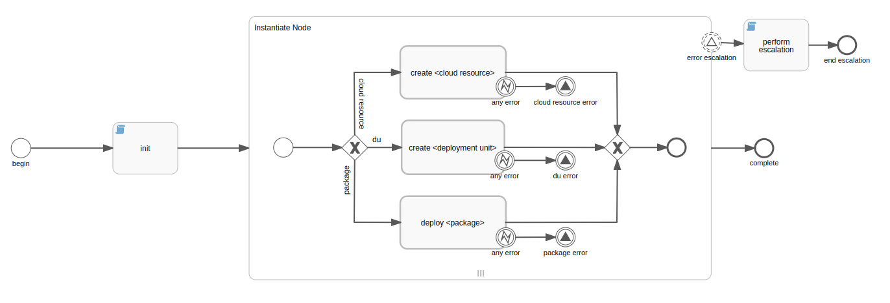
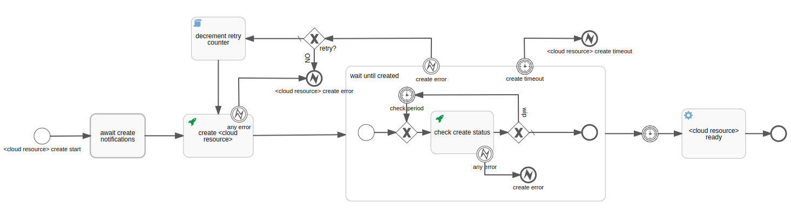
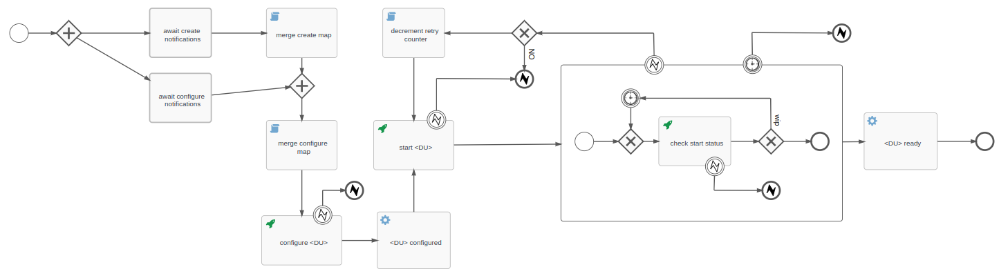
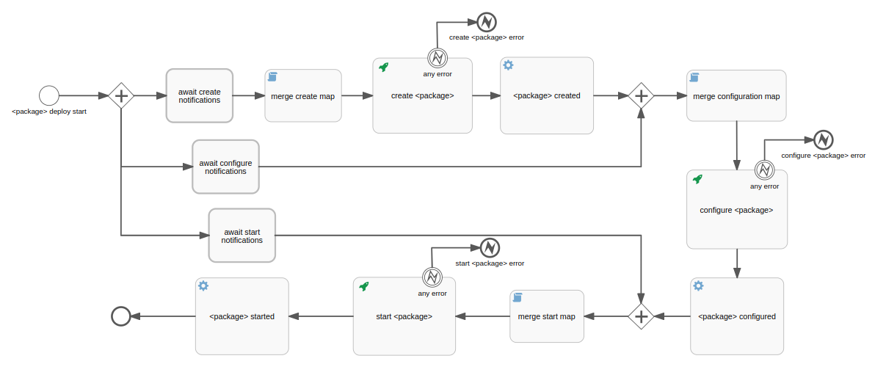

# Code documentation for TORCH_v2 BPMN workflows

TORCH_v2 has own main BPMN workflow for each major lifecycle operation.

## Deployment

 
@TODO

    
  
### BPMN workflow to Deploy Resources:
 

 
  
Cloud Resources usually are available after being created and the configuration is usually executed at the creation step, so in this case the BPMN workflow do not make use of the "start" or the "configured" operation of the Standard interface. A Resource that is observed (by 'check') to be created pass directly from the CREATING state to the AVAILABLE/STARTED state.
   
More detail on the CREATESERVICE workflow can be found [here](bpmn_createservice.md).
  

### BPMN workflow to Deploy DUs:
 

  

### BPMN workflow to Deploy Packages:
 

 
  
@TODO
  
