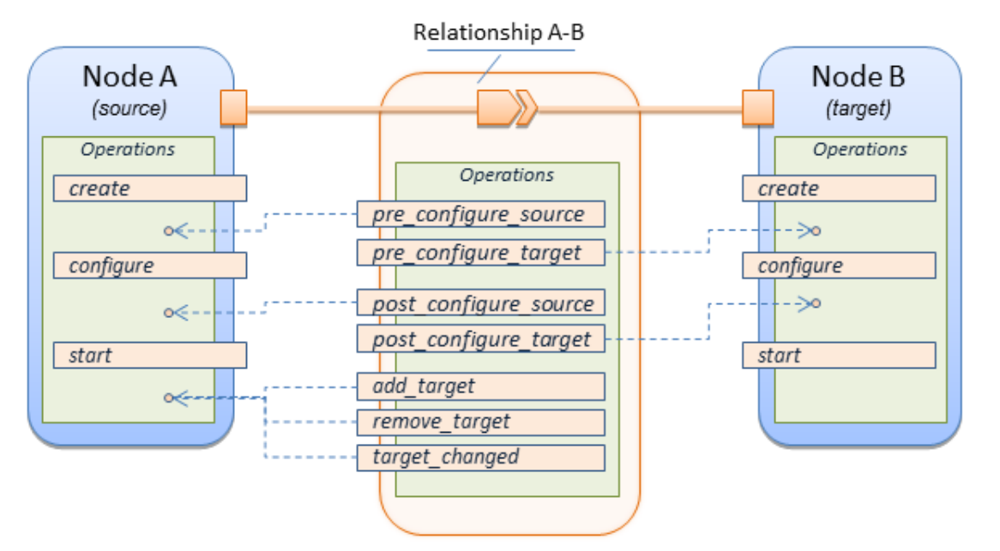

# Introduction to TORCH_v2 BPMN workflows: design principles & common elements

In TORCH_v2, la logica di orchestrazione cloud-agnostic è implementata attraverso un insieme di workflow BPMN 2.0 che vengono eseguiti da un BPMN Engine che nel nostro caso è l'engine open-source Flowable Rest 6.6.0. Questi BPMN workflows, che concretamente si presentano come un insieme di file XML, implementano quindi l'insieme di azioni generali (indipendenti dalle tecnologie cloud specifiche scelte) che permettono di gestire correttamente il ciclo di vita dell'applicazione distribuita che vogliamo deployare e gestire con TORCH_v2.  
Come ben sappiamo, TORCH_v2 si aspetta in ingresso una applicazione distribuita da gestire e un contesto infrastrutturale su cui fare il deploy di quest'ultima, e queste informazioni devono essere fornite sotto forma di file CSAR. Concretamente ciò significa che data una applicazione complessa distribuita, formata da diversi microservizi che cooperano per il raggiungimento di un obbiettivo comune, e un contesto infrastrutturale, come una federazione di cluster, l'utente di TORCH_v2 deve prima di tutto mappare microservizi e elementi infrastrutturali in entità TOSCA usando i tipi base forniti da TORCH_v2. Il risultato di questo mapping è l'ottenimento di un Template TOSCA (da cui è immediato ricavare un CSAR) che rappresenta la nostra applicazione distribuita in un modo che TORCH_v2 può parsare, interpretare e su cui può agire.  
  
Se in questo momento non ci interessa approfondire come ottenere il Template TOSCA, e di conseguenza il CSAR, da fornire a TORCH_v2 partendo dall'applicazione (argomento ampiamente trattato nella documentazione inerente il modello TOSCA di TORCH_v2), è invece importante sottolineare ancora una volta che TORCH_v2 conosce l'applicazione da deployare solo nella sua rappresentazione TOSCA e che quindi la sua logica di orchestrazione (quindi BPMN workflows e Service Connectors) si basa sui concetti di Nodo, Relazione, Capacità e Requisiti TOSCA per prendere decisioni. Non deve quindi sorprendere che la logica interna dei BPMN Workflows sia strettamente legata alla specifica TOSCA. Nei BPMN workflows non si fa il deploy di un microservizio, bensì si eseguono in ordine le operazioni delle interfacce di un Nodo al fine di portarlo dallo stato INIITAL allo stato STARTED. Non si risolvono le dipendenze del microservizio, bensì si instaurano Relazioni tra due Nodi. Non si monitorano i microservizi per vedere se sono "healthy", bensì si riflettono indietro gli Attributi del Nodo, tra cui anche il suo stato. Una volta capito questo, il resto è abbastanza immediato. Nelle sezioni successive descriveremo meglio come le entità TOSCA vengono interpretate nei BPMN workflows per ottenere una corretta gestione del ciclo di vita dell'applicazione che è rappresentata da queste entità.

## Principi di Design per i BPMN Workflow di TORCH-v2:

Elenchiamo di seguito alcuni dei principi base su cui si basa l'attuale implementazione dei BPMN workflow di TORCH_v2

### One main BPMN workflow for each major lifecycle operation

- input e output dei main workflow

- output:

L' "output" dei BPMN workflow è l'esecuzione della logica delle varie operazioni delle interfacce dei nodi, nonchè completamente della gestione del ciclo di vita delle applicazioni gestite. I BPMN workflow definiti comunicano con i connettori tramite HTTP e passano loro le informazioni necessarie nel body delle richieste HTTP mentre ricevono nella risposta gli attributi aggiornati del nodo, così da poterli passare agli step successivi oppure ad altri processi BPMN che stanno eseguento in parallelo e hanno bisogno di quelle informazioni per continuare la loro esecuzione (è questo il caso di processi BPMN che stanno eseguendo su nodi che dipendono da questo). Nessuna informazione viene attivamente inviata indietro alla Dashboard. La Dashboard può però usare le API history di flowable per ispezionare periodicamente le variabili settate nei vari BPMN workflow, estrarre quelle di interesse e mostrarle all'utente. Questo è esattamente il meccanismo usato per mostrare lo stato attaule del deploy all'utente e per mostrare gli attributi dei vari Nodi.

- mostra input generale che si aspetta il main workflow

### The BPMN workflows are fixed and general

- regole generali che permettono di completare l'operazione indipendentemnete dalle specifiche tecnologie usate per quel nodo. Siccome però non è semplcie trovare una formula valida per qualunque tipologia di nodo, abbiamo diviso l'insieme di tutti i possibili nodi in tre macro-categoria la cui gestione è considerata sufficientemente diversa da richiedere step generali diversi. Per questo motivo il BPMN principale assume sostanzialmente il ruolo di smistatore di nodi che invoca in base alla macro-categoria del nodo il giusto BPMN workflow secondario. In ogni caso il numero di workflow secondari è basso proprio perchè le azioni sono molto generali. 

- fixed nel senso che TORCH_v2 non supporta l'injection di custom BPMN workflow da parte dei propri utenti. La gestione del ciclo di vita non è quindi modificabile dall'utente e si basa su come sono stati implementati i BPMN workflow di TORCH_v2. L'unico modo per customizzare la gestione del ciclo di vita è mettere mano al codice sorgente di TORCH_v2 e modificare i BPMN workflow.

- mostra le categorie e sotto-categorie attualmente supportate in TORCH

### The BPMN workflows follow the Standard interface proposed in TOSCA Simple Profile 1.X

- In TOSCA 2.0 non viene consigliato nessun insieme di step in particolare per supportare il ciclo di vita delle applicazioni in virtù anche del fatto che si suppone sia l'utente che crea il template TOSCA a fornire anche parallelamente l'implementazione (e.g; BPMN workflow custom) di queste operazioni per i propri nodi. Supportare logica custom non è semplice e per questo attualmente non è supportato da TORCH_v2. Per questo motivo è stato necessario decidere di quali step generali avrebbero i nostri BPMN workflow statici dovuto contenere e in che ordine. Abbiamo deciso di usare quanto proposto da TOSCA Simple Profile 1.X per l'[interfaccia Standard](https://docs.oasis-open.org/tosca/TOSCA-Simple-Profile-YAML/v1.3/TOSCA-Simple-Profile-YAML-v1.3.html#:~:text=5.8.4%20tosca.interfaces.node.lifecycle.Standard).

- mostra l'interfaccia standard da modello TOSCA

## Elementi comuni di tutti i BPMN Workflows di TORCH_v2:

### The Relationship are not "first-class entity" (for now)

- Relazioni non sono considerate al pari dei Nodi e per questo non esistono BPMN workflow apposta per supportare il loro ciclo di vita. In futuro sarebbe sicuramente interessante poter supportare anche il loro ciclo di vita per avere maggiore flessibilità. I BPMN workflow potranno ispirarsi all'interfaccia Configure proposta sempre in TOSCA Simple Profile 1.X.

- Sempre in TOSCA Simple Profile viene anche mostrato come dovrebbero essere alternate le operaizoni del ciclo di vita dei Nodi con quelle delle Relazioni per gestire correttamente il tutto. L'immagine di seguito riassume quando definito nella specifica.

  

### The BPMN workflows must habdle Attribute reflections

- Visto che la riflessione degli attributi è un concetto puramente TOSCA e orizzontale non ha senso che siano i Connettori ad occuparsi della riflessione. Devono quindi occuparsene i BPMN workflow

- gli attributi sono "fetched" dalla Dashboard periodicamente, non è richiesto che siano i BPMN workflow a pushare queste informazioni.

### The BPMN workflows take care of propagating errors and updating the status of the various TOSCA Node

- Gli Errori e l'aggiornamento dello stato dei nodi sono a carico dei BPMN workflow. Eventuale logica di reazione agli errori, compensazione o altro spetta sempre ai BPMN workflow. Anche in questo caso non possono essere i Connettori perchè questi conoscono i dettagli solo dei propri nodi mentre per effettuare azioni correttivi è necessario avere una visione di insieme.

### Steps of a BPMN Workflow must allow inputs to be received from previous Step and outputs to be passed to successive Step

- Permettere ai vari step di comunicarsi informazioni è estremamente utile per gestire tutte quelle informazioni che possono essere note solamente a runtime. Ci sono linee guida su come queste informazioni devono essere passate ma non esiste un insieme standard che deve per forza essere passato. Per ora ogni specifico Connettore ammette certi input e produce certi output, la compatibilità intesa come la sicurezza che gli input passati saranno letti, o gli output passati saranno usati non c'è ma è estremamente probabile visto che gli step seppure diversi interessano solitamente lo stesso insieme di tecnologie per uno stesso nodo e quindi quasi sicuramente ci si aspetta esattamente gli input ricevuti.

